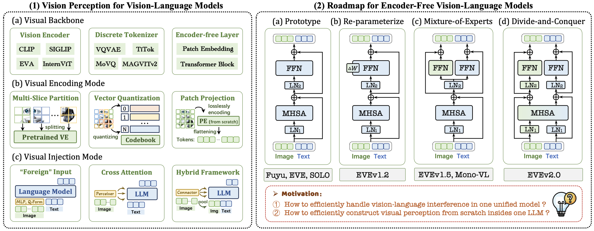
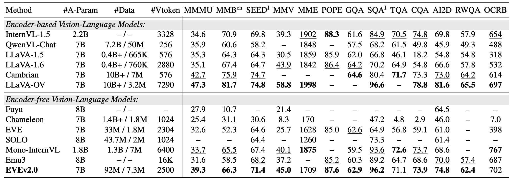

#  EVEv2: Improved Baselines for Encoder-Free Vision-Language Models

PyTorch implementation for ICCV2025 paper of **[EVEv2: Improved Baselines for Encoder-Free Vision-Language Models](https://arxiv.org/abs/2502.06788)**.  

## 📜 News   
[2025/06] 🔥🔥🔥 **EVEv2** has been accepted by **ICCV 2025** !  
[2025/02] We release [training code](https://github.com/baaivision/EVE/blob/main/EVEv2/README.md) and [EVE-7B-HD-v2.0](https://huggingface.co/BAAI/EVE-7B-HD-v2.0) weights ! 🚀   
[2025/02] The [paper](https://arxiv.org/abs/2502.06788) is released ! 🚀   
[2024/11] 💥💥💥 **EVEv2** has been completed !    

## 💡 Motivation

<p align="center">
  
</p>

- **How to efficiently construct visual perception from scratch inside one LLM?**   

- **How to effectively mitigate catastrophic knowledge-forgetting issues in LLMs?**   

- **How to effectively handle vision-language interference in one unified model?**  


## 🛸 Architecture
<p align="center">
  
</p>

- **Authors**: [Haiwen Diao*](https://scholar.google.com/citations?user=46eCjHQAAAAJ&hl=zh-CN), [Xiaotong Li*](https://scholar.google.com/citations?hl=zh-CN&user=cpCE_T4AAAAJ), [Yufeng Cui*](https://scholar.google.com/citations?user=5Ydha2EAAAAJ&hl=zh-CN&oi=ao), [Yueze Wang*](https://scholar.google.com/citations?user=ga2MKaMAAAAJ&hl=zh-CN), [Haoge Deng](https://scholar.google.com/citations?user=S2sbvjgAAAAJ&hl=zh-CN), [Ting Pan](https://scholar.google.com/citations?user=qQv6YbsAAAAJ&hl=zh-CN), [Wenxuan Wang](https://scholar.google.com/citations?hl=zh-CN&user=75OyC-oAAAAJ), [Huchuan Lu📧](https://scholar.google.com/citations?user=D3nE0agAAAAJ&hl=zh-CN), [Xinlong Wang📧](https://scholar.google.com/citations?user=DPz0DjYAAAAJ&hl=zh-CN)

- **Institutes**: Dalian University of Technology; Beijing Academy of Artificial Intelligence; Peking University; Beijing University of Posts and Telecommunications; University of Chinese Academy of Sciences; Chinese Academy of Sciences Institute of Automation    
- **Model Zoo**: [🤗[EVE-7B-HD-v2.0](https://huggingface.co/BAAI/EVE-7B-HD-v2.0)] 

## 💡 Highlights
- 🔥 **Superior Capability:** *An originated encoder-free* LVLM with *minimalist* patch embedding layer and *arbitrary* image aspect ratio, continuing to approach existing *modular encoder-based* LVLMs.  

- 🔥 **Data Efficiency:** Filter solely *92M* publicly avaliable data from OpenImages, SAM, LAION, Datacomp for pre-training; Utilizing *7.3M* [Infinity-MM](https://huggingface.co/datasets/BAAI/Infinity-MM) and [LLaVA-onevision](https://huggingface.co/datasets/lmms-lab/LLaVA-OneVision-Data) SFT data for [EVE-7B-HD-v2.0](https://huggingface.co/BAAI/EVE-7B-HD-v2.0).   

- 🔥 **Pioneering Route:** We attempt to provide an *efficient*, *transparent*, and *practical* training strategy and procedure for developing a pure decoder-only architecture across modalities.  

## 🤖 Model Zoo

The usage of EVE checkpoints should comply with the base LLM's model license: [Llama 2](https://github.com/facebookresearch/llama/blob/main/MODEL_CARD.md).   

<p align="center">
  
</p>

## Contents
- [Install](#install)
- [Quick Usage](#quick-usage)
- [Data](#data)
- [Train](#train)
- [Evaluation](#evaluation)

## Install

#### Environment

```bash
git clone https://github.com/baaivision/EVE.git
cd EVE/EVEv2
conda create -n eve_envs python=3.10 -y
conda activate eve_envs

pip install --upgrade pip
pip install -e .
pip install -e ".[train]"
pip install flash-attn --no-build-isolation
```

#### Preparation

[NOTE]: The llama-related code only shows the EVE1.2's implementation details, which is copied from our another project. The training and testing of the current project **do not activate** this part, which is for reference only.      

[NOTE]: One can find the config of [openai/eve-anyratio-res1600-patch16](https://github.com/baaivision/EVE/blob/main/EVEv2/openai/eve-anyratio-res1600-patch16/preprocessor_config.json) at the root of EVEv2 project.      

[NOTE]: Download `qwen_model` and extract them into `lmsys/` path:
- [Qwen2.5-7B-Instruct](https://huggingface.co/Qwen/Qwen2.5-7B-Instruct).   

```none
lmsys
├── Qwen2.5-7B-Instruct
│   │── config.json
│   │── ...
```

## Quick Usage
<summary>Example Code</summary>

```python
from eve.model.builder import load_pretrained_model
from eve.mm_utils import get_model_name_from_path
from eve.eval.run_eve import eval_model

model_path = "Absolute Path of BAAI/EVE-7B-HD-v2.0"

tokenizer, model, image_processor, context_len = load_pretrained_model(
    model_path=model_path,
    model_base=None,
    model_name=get_model_name_from_path(model_path)
)
```

Check out the details wth the `load_pretrained_model` function in `eve/model/builder.py`.

You can also use `eve/eval/eval_one_sample.py` to get the output easily. By doing so, you can use this code on Colab directly after downloading this repository.

```python
# run script
CUDA_VISIBLE_DEVICES=0 python eve/eval/eval_one_sample.py
```
</details>

## Data

You should follow this instruction [Data.md](docs/Data.md) to manage the datasets. 

## Train

**(0) LLM-guided Pre-aligning Stage:** 
we only adopt 10M of 44M image-text data (EVE-recap-10M) to train patch embedding layers. *It really does count for efficient training, as it prevents collapse and accelerates convergence throughout the entire process.*  

| Model | Epoch | Batch_Size | Learning_Rate | LR_Schedule | Warmup_Ratio | Max_Length | Weight_decay | Optimizer | DeepSpeed |
| :--- | :---: | :---: | :---: | :---: | :---: | :---: | :---: | :---: | :---: | 
|EVEv2_stage0| 1 | 1024 | 2e-4 | cosine decay | 0.03 | 2048 | 0 | AdamW | zero3 |

Training script for EVEv2_stage0 as follows:   
```bash
bash scripts/eve/0_eve7b_prealign_anyratio_ve.sh ${node_rank} ${master_addr}
```

Then copy llm weights for initializing vision parts:   
```bash
bash scripts/eve/0_notrain_copy_llm_weight_into_moe.sh ${master_addr}
```

**(1) Vision Perception Learning Stage:** 
we first adopt 29M image-text data (EVE-recap-29M) for low image resolutions and extra 48M pretraining data (EVE-recap-48M) for high image resolutions, where we only train patch embedding layer and vision parts inside the LLM.   

| Model | Epoch | Batch_Size | Learning_Rate | LR_Schedule | Warmup_Ratio | Max_Length | Weight_decay | Optimizer | DeepSpeed |
| :--- | :---: | :---: | :---: | :---: | :---: | :---: | :---: | :---: | :---: | 
|EVEv2_stage1.0| 1 | 1024 | 1e-4 | cosine decay | 0.03 | 2048 | 0 | AdamW | zero3 |  
|EVEv2_stage1.1| 1 | 1024 | 5e-5 | cosine decay | 0.03 | 4096 | 0 | AdamW | zero3 |

Training script for EVEv2_stage1.0 as follows:   
```bash
bash scripts/eve/1.0_eve7b_prealign_anyratio_ve_moe.sh ${node_rank} ${master_addr}
```

Then training script for EVEv2_stage1.1 as follows:   
```bash
bash scripts/eve/1.1_eve7b_prealign_anyratio_ve_moe_hd.sh ${node_rank} ${master_addr}
```

**(2) Vision-Text Fully-aligning Stage:**
we use 15M samples from Infinity-MM general visual instruction datasets (EVE-multi-task-15M) to train the full modules.

| Model | Epoch | Batch_Size | Learning_Rate | LR_Schedule | Warmup_Ratio | Max_Length | Weight_decay | Optimizer | DeepSpeed |
| :--- | :---: | :---: | :---: | :---: | :---: | :---: | :---: | :---: | :---: | 
| EVEv2_stage2 | 1 | 512 | 2e-5 | cosine decay | 0.03 | 4096 | 0 | AdamW | zero3 |  

Training script for EVEv2_stage2 as follows:   
```bash
bash scripts/eve/2_eve7b_fullalign_anyratio_hd.sh ${node_rank} ${master_addr}
```

**(3) Supervised Fine-tuning Stage:** 
We finetune the entire architecture with high-quality, multi-source instruction datasets (EVE-sft-7M), including LLaVA-onevision and partial Infinity-MM-instruct.

| Model | Epoch | Batch_Size | Learning_Rate | LR_Schedule | Warmup_Ratio | Max_Length | Weight_decay | Optimizer | DeepSpeed |
| :--- | :---: | :---: | :---: | :---: | :---: | :---: | :---: | :---: | :---: | 
| EVE_7B_HD_v2.0 | 1 | 512 | 1e-5 | cosine decay | 0.03 | 5000 | 0 | AdamW | zero3 |  

Training scripts for EVE_7B_HD_v2.0 as follows:   
```bash
bash scripts/eve/3_eve7b_finetune_anyratio_hd.sh ${node_rank} ${master_addr}
``` 

**[NOTE]:**   
To train on fewer GPUs, you can reduce the `per_device_train_batch_size` and increase the `gradient_accumulation_steps` accordingly. Always keep the global batch size the same: `per_device_train_batch_size x gradient_accumulation_steps x num_gpus`.

## Evaluation

To ensure the reproducibility, we evaluate the models with greedy decoding. We do not evaluate using beam search to make the inference process consistent with the chat demo of real-time outputs.

See [Evaluation.md](docs/Evaluation.md).

## ❤️ Acknowledgments 
- [LLaVA](https://github.com/haotian-liu/LLaVA), [DenseFusion](https://github.com/baaivision/DenseFusion): Thanks for their wonderful works and code!
- [QwenLM](https://github.com/QwenLM/Qwen2.5): The amazing open-sourced large language model series!

## ✒️ Citation 
If **EVEv2** is helpful for your research, please consider **star** ⭐ and **citation** 📝 :
```bibtex
@article{diao2025EVEv2,
  title={EVEv2: Improved Baselines for Encoder-Free Vision-Language Models},
  author={Diao, Haiwen and Li, Xiaotong and Cui, Yufeng and Wang, Yueze and Deng, Haoge and Pan, Ting and Wang, Wenxuan and Lu, Huchuan and Wang, Xinlong},
  journal={arXiv preprint arXiv:2502.06788},
  year={2025}
}
```

## 📄 License 
The content of this project itself is licensed under [LICENSE](https://github.com/baaivision/EVE/blob/main/LICENSE).
