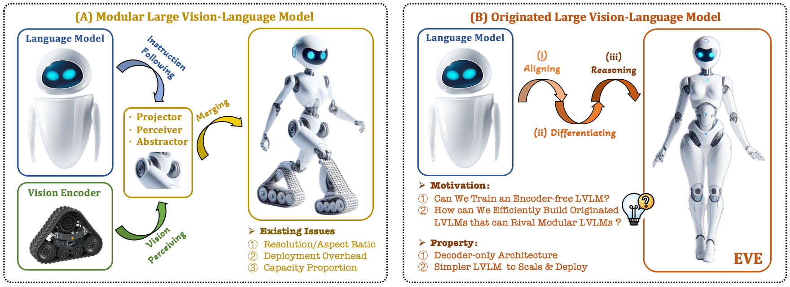

#  EVE Series: Encoder-Free VLMs from BAAI

<p align="center">
  
</p>

- [EVEv1](https://github.com/baaivision/EVE/EVEv1/README.md) - Unveiling Encoder-Free Vision-Language Models (NeurIPS 2024, 2024/09)

- [EVEv2](https://github.com/baaivision/EVE/EVEv2/README.md) - EVEv2: Improved Baselines for Encoder-Free Vision-Language Models (ArXiv 2025, 2025/02)


## 💡 Motivation

- **Can we remove vision encoder from VLMs?**

- **How to transfer an LLM to an encoder-free VLM efficiently and stably?**
  
- **How to bridge the performance gap between encoder-free and encoder-based VLMs?** 

## 📜 News
[2025/02/09] 🔥🔥🔥 The [paper](https://github.com/baaivision/EVE/EVEv2/images/EVEv2.0.pdf), [weights](https://huggingface.co/BAAI/EVE-7B-HD-v2.0), and [code](https://github.com/baaivision/EVE/EVEv2/README.md) of **EVEv2** are released ! 💥    
[2024/09/26] Our **EVE** has been accepted by **NeurIPS 2024** (**spotlight**) ! 💥       
[2024/06/18] The [paper](https://arxiv.org/abs/2406.11832), [weights](https://huggingface.co/BAAI/EVE-7B-HD-v1.0), and [code](https://github.com/baaivision/EVE/EVEv1/README.md) of **EVE** are released ! 💥   

## 💡 Highlights
- 🔥 **Superior Capability:** *An originated encoder-free* LVLM with *arbitrary* image aspect ratio, outperforming the counterparts and approaching existing *modular encoder-based* LVLMs.  

- 🔥 **Data Efficiency:** Filter and recaption solely *<100M* publicly avaliable data from OpenImages, SAM, LAION, Datacomp for pre-training.  

- 🔥 **Pioneering Route:** We attempt to provide an *efficient*, *transparent*, and *practical* training strategy and procedure for developing a pure decoder-only architecture across modalities.  


## ✒️ Citation 
If **EVE** is helpful for your research, please consider **star** ⭐ and **citation** 📝 :
```bibtex
@article{diao2024EVE,
  title={Unveiling Encoder-Free Vision-Language Models},
  author={Diao, Haiwen and Cui, Yufeng and Li, Xiaotong and Wang, Yueze and Lu, Huchuan and Wang, Xinlong},
  journal={arXiv preprint arXiv:2406.11832},
  year={2024}
}
```

```bibtex
xxxx
```

## 📄 License 
The content of this project itself is licensed under [LICENSE](https://github.com/baaivision/EVE/blob/main/LICENSE).
