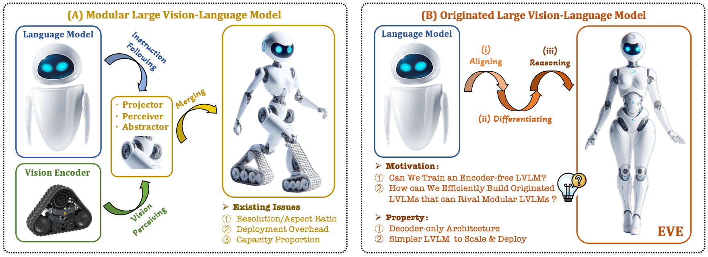
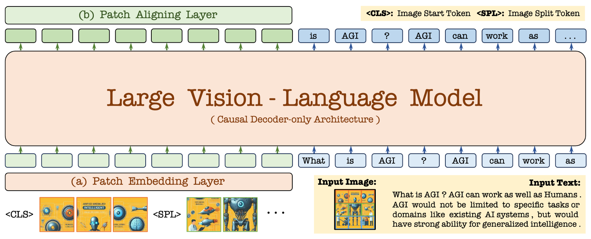

#  EVE: Unveiling Encoder-Free Vision-Language Models

Official pytorch implementation of **[Unveiling Encoder-Free Vision-Language Models](https://arxiv.org/abs/2406.11832)**.  

## 📜 News
[2024/06/30] We release [training code](https://github.com/baaivision/EVE) ! 🚀 We are uploading [EVE-7B](https://huggingface.co/BAAI/EVE-7B-v1.0) (maybe 2 days) ! 💥   
[2024/06/23] We release [evaluation code](https://github.com/baaivision/EVE), [EVE-7B-Pretrain](https://huggingface.co/BAAI/EVE-7B-Pretrain-v1.0), and [EVE-7B-HD](https://huggingface.co/BAAI/EVE-7B-HD-v1.0) weights ! 🚀   
[2024/06/18] The [paper](https://arxiv.org/abs/2406.11832) is released ! 💥   

## 💡 Motivation

- **Can we remove vision encoder from VLMs?**

- **How to transfer an LLM to an encoder-free VLM efficiently and stablely?**
  
- **How to bridge the performance gap between encoder-free and encoder-based VLMs?** 


<p align="center">
  
</p>

## 🛸 Architecture
<p align="center">
  
</p>

- **Authors**: [Haiwen Diao*](https://scholar.google.com/citations?user=46eCjHQAAAAJ&hl=zh-CN), [Yufeng Cui*](https://scholar.google.com/citations?user=5Ydha2EAAAAJ&hl=zh-CN&oi=ao), [Xiaotong Li](https://scholar.google.com/citations?hl=zh-CN&user=cpCE_T4AAAAJ), [Yueze Wang](https://openreview.net/profile?id=~Yueze_Wang1), [Huchuan Lu📧](https://scholar.google.com/citations?user=D3nE0agAAAAJ&hl=zh-CN), [Xinlong Wang📧](https://scholar.google.com/citations?user=DPz0DjYAAAAJ&hl=zh-CN)

- **Institutes**: Dalian University of Technology; Beijing Academy of Artificial Intelligence; Peking University
- **Model Zoo**: [🤗[EVE-7B-Pretrain](https://huggingface.co/BAAI/EVE-7B-Pretrain-v1.0)] [🤗[EVE-7B](https://huggingface.co/BAAI/EVE-7B-v1.0)] [🤗[EVE-7B-HD](https://huggingface.co/BAAI/EVE-7B-HD-v1.0)] 

## 💡 Highlights
- 🔥 **Superior Capability:** *An originated encoder-free* LVLM with *arbitrary* image aspect ratio, outperforming the counterpart *[Fuyu-8B](https://huggingface.co/adept/fuyu-8b)* and approaching existing *modular encoder-based* LVLMs.  

- 🔥 **Data Efficiency:** Filter solely *33M* publicly avaliable data from OpenImages, SAM, LAION for pre-training; Utilizing *665K* LLaVA SFT data for [EVE-7B](https://huggingface.co/BAAI/EVE-7B-v1.0), and extra *1.2M* SFT data for [EVE-7B (HD)](https://huggingface.co/BAAI/EVE-7B-HD-v1.0).  

- 🔥 **Training Efficiency:** Trained with *two 8-A100 (40G) nodes* in ~*9* days or *four 8-A100 nodes* in ~*5* days

- 🔥 **Pioneering Route:** We attempt to provide an *efficient*, *transparent*, and *practical* training strategy and procedure for developing a pure decoder-only architecture across modalities.  

## 🤖 Model Zoo

The usage of EVE checkpoints should comply with the base LLM's model license: [Llama 2](https://github.com/facebookresearch/llama/blob/main/MODEL_CARD.md).   

| Model | LLM | Weight | VQAv2 | GQA | VizWiz | SQA_I | TextVQA | POPE | MME_P | MMBench | SEED | MM_Vet | 
|---|---|---|---|---|---|---|---|---|---|---|---|---|
| EVE_7B_Pretrain | Vicuna_7B | [HF_link](https://huggingface.co/BAAI/EVE-7B-Pretrain-v1.0) | -- | -- | -- | -- | -- | -- | -- | -- | -- | -- |
| EVE_7B | Vicuna_7B | [HF_link](https://huggingface.co/BAAI/EVE-7B-v1.0) | 75.4 | 60.8 | 41.8 | 63.0 | 51.9 | 83.6 | 1217.3 | 49.5 | 54.3 | 25.6 |
| EVE_7B_HD | Vicuna-7B | [HF_link](https://huggingface.co/BAAI/EVE-7B-HD-v1.0) | 78.6 | 62.6 | 51.1 | 64.9 | 56.8 | 85.0 | 1305.7 | 52.3 | 56.8 | 25.7 |

## 👨‍💻 Todo List
- [ ] Involve more modalities into the unified EVE network.
- [ ] Full EVE series trained with more data, varied sizes, and better base models.

## Contents
- [Install](#install)
- [Quick Usage](#quick-usage)
- [Demo](#demo)
- [Data](#data)
- [Train](#train)
- [Evaluation](#evaluation)

## Install

#### Environment

```bash
git clone https://github.com/baaivision/EVE.git
cd EVE
conda create -n eve_envs python=3.10 -y
conda activate eve_envs

pip install --upgrade pip
pip install -e .
pip install -e ".[train]"
pip install flash-attn --no-build-isolation
```

#### Preparation

Download `vicuna_model` and extract them into `lmsys/` path:
- [vicuna-7b-v1.5](https://huggingface.co/lmsys/vicuna-7b-v1.5).    

Download `preprocessor` and extract them into `openai/` path:
- [clip-vit-large-patch14-336](https://huggingface.co/openai/clip-vit-large-patch14-336);  
- [eve-patch14-anypixel-672](https://drive.google.com/file/d/1f_mA4owjm0v3awrzPv4LOURz6IzVFVZ6/view?usp=sharing);  
- [eve-patch14-anypixel-1344](https://drive.google.com/file/d/1V7hz37X7n9s2KmghoQ9bDVHE6J4HuQ7z/view?usp=sharing).  

```none
lmsys
├── vicuna-7b-v1.5
│   │── config.json
│   │── ...
openai
├── clip-vit-large-patch14-336
│   │── config.json
│   │── ...
├── eve-patch14-anypixel-672
│   │── preprocessor_config.json
│   │── ...
├── eve-patch14-anypixel-1344
│   │── preprocessor_config.json
│   │── ...
```

## Quick Usage
<summary>Example Code</summary>

```python
from eve.model.builder import load_pretrained_model
from eve.mm_utils import get_model_name_from_path
from eve.eval.run_eve import eval_model

model_path = "BAAI/EVE-7B-HD-v1.0"

tokenizer, model, image_processor, context_len = load_pretrained_model(
    model_path=model_path,
    model_base=None,
    model_name=get_model_name_from_path(model_path)
)
```

Check out the details wth the `load_pretrained_model` function in `eve/model/builder.py`.

You can also use `eve/eval/eval_one_sample.py` to get the output easily. By doing so, you can use this code on Colab directly after downloading this repository.

```python
# run script
CUDA_VISIBLE_DEVICES=0 python eve/eval/eval_one_sample.py
```
</details>

## Demo
You can also build up your local demo using the following script:
```python
# run script
python tools/app.py
```

## Data

You should follow this instruction [Data.md](docs/Data.md) to manage the datasets. Currently, we provide direct download access to the web data. However, to avoid potential disputes, we plan to release URLs for these datasets rather than the raw data in the near future.

## Train

**(1) LLM-guided Pre-aligning Stage:** 
we only adopt 16M of 33M image-text data
(EVE-cap16/33M) to train patch embedding and aligning layers. *It really does count for efficient training, as it prevents collapse and accelerates convergence throughout the entire process.*  

| Model | Epoch | Batch_Size | Learning_Rate | LR_Schedule | Warmup_Ratio | Max_Length | Weight_decay | Optimizer | DeepSpeed |
| :--- | :---: | :---: | :---: | :---: | :---: | :---: | :---: | :---: | :---: | 
|EVE_Prealign| 1 | 512 | 4e-4 | cosine decay | 0.03 | 2048 | 0 | AdamW | zero3 |

Training script for EVE_Prealign as follows:   
```bash
bash scripts/eve/eve7b_prealign.sh ${node_rank} ${master_addr}
```

**(2) Generative Pre-training Stage:**
we use all 33M image-text pairs (EVE-cap33M) to train patch embedding and aligning layers, and the full LLM modules.

| Model | Epoch | Batch_Size | Learning_Rate | LR_Schedule | Warmup_Ratio | Max_Length | Weight_decay | Optimizer | DeepSpeed |
| :--- | :---: | :---: | :---: | :---: | :---: | :---: | :---: | :---: | :---: | 
| EVE_Pretrain | 1 | 512 | 4e-5 | cosine decay | 0.01 | 2048 | 0 | AdamW | zero3 |  

Training script for EVE_Pretrain as follows:   
```bash
bash scripts/eve/eve7b_pretrain.sh ${node_rank} ${master_addr}
```

**(3) Supervised Fine-tuning Stage:** 
We finetune the entire architecture with LLaVA-mix-665K for EVE-7B and extra 1.2M SFT conversation data for EVE-7B (HD).  

| Model | Epoch | Batch_Size | Learning_Rate | LR_Schedule | Warmup_Ratio | Max_Length | Weight_decay | Optimizer | DeepSpeed |
| :--- | :---: | :---: | :---: | :---: | :---: | :---: | :---: | :---: | :---: | 
| EVE_Finetune | 1 | 128 | 2e-5 | cosine decay | 0.01 | 2048/4096 | 0 | AdamW | zero3 |  

Training scripts for EVE_7B and EVE_7B_HD as follows:   
```bash
bash scripts/eve/eve7b_finetune.sh ${node_rank} ${master_addr}
bash scripts/eve/eve7b_finetune_hd.sh ${node_rank} ${master_addr}
``` 

**[NOTE]:**   
To train on fewer GPUs, you can reduce the `per_device_train_batch_size` and increase the `gradient_accumulation_steps` accordingly. Always keep the global batch size the same: `per_device_train_batch_size x gradient_accumulation_steps x num_gpus`.

## Evaluation

To ensure the reproducibility, we evaluate the models with greedy decoding. We do not evaluate using beam search to make the inference process consistent with the chat demo of real-time outputs.

See [Evaluation.md](docs/Evaluation.md).

## ❤️ Acknowledgments 
- [LLaVA](https://github.com/haotian-liu/LLaVA), [ShareGPT](https://github.com/ShareGPT4Omni/ShareGPT4V): Thanks for their wonderful works and code!
- [Vicuna](https://github.com/lm-sys/FastChat): The amazing open-sourced large language model series!

## ✒️ Citation 
If **EVE** is helpful for your research, please consider **star** ⭐ and **citation** 📝 :
```bibtex
@article{diao2024EVE,
  title={Unveiling Encoder-Free Vision-Language Models},
  author={Diao, Haiwen and Cui, Yufeng and Li, Xiaotong and Wang, Yueze and Lu, Huchuan and Wang, Xinlong},
  journal={arXiv:2406.11832},
  year={2024}
}
```

## 📄 License 
The content of this project itself is licensed under [LICENSE](https://github.com/baaivision/EVE/blob/main/LICENSE).
